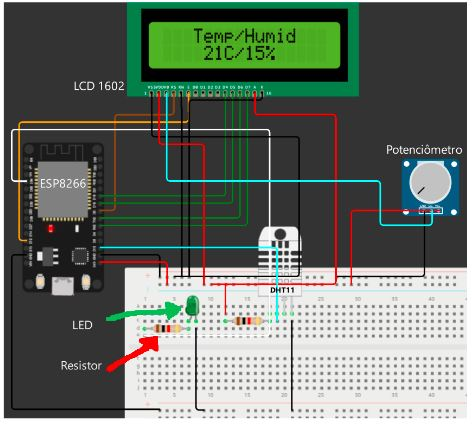

# Disciplina de Objetos Inteligentes Conectados curso ADS

Tempo Certo Medidor de Clima Interno: Residência Inteligente.
Hardware: ESP8266 Nodemcu
Sensor: DTH11
Atuadores: LED, LCD

Código do projeto, já incluso MQTT como implementação para comunicação web.

Usar Arduino IDE para melhor implementação.

Diagrama:

